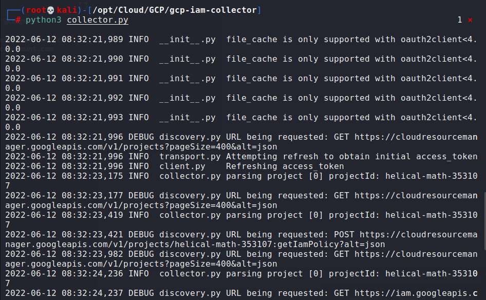
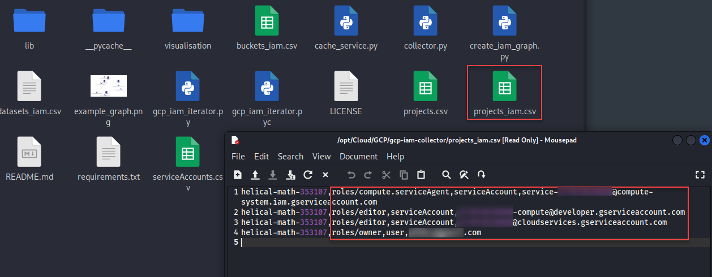

## Python scripts for collecting and visualizing Google Cloud Platform IAM permissions.

gcp-iam-collector - https://github.com/marcin-kolda/gcp-iam-collector

GCP IAM graph is created using vis.js and its static HTML page, see example interactive graph.

**Prerequisites** 
* Install dependencies:
  * $ pip install -r requirements.txt
* Install gcloud CLI tool.
* Setup Google Application Default Credentials:
  * $ gcloud auth application-default login

**Key features**
* GCP IAM collector iterates over projects using Google Cloud Resource Manager API and dumps to CSV files:
  * all available GCP projects
  * projects IAM permissions
  * projects service account and their keys
  * BigQuery dataset ACLs
  * Cloud Storage bucket ACLs

