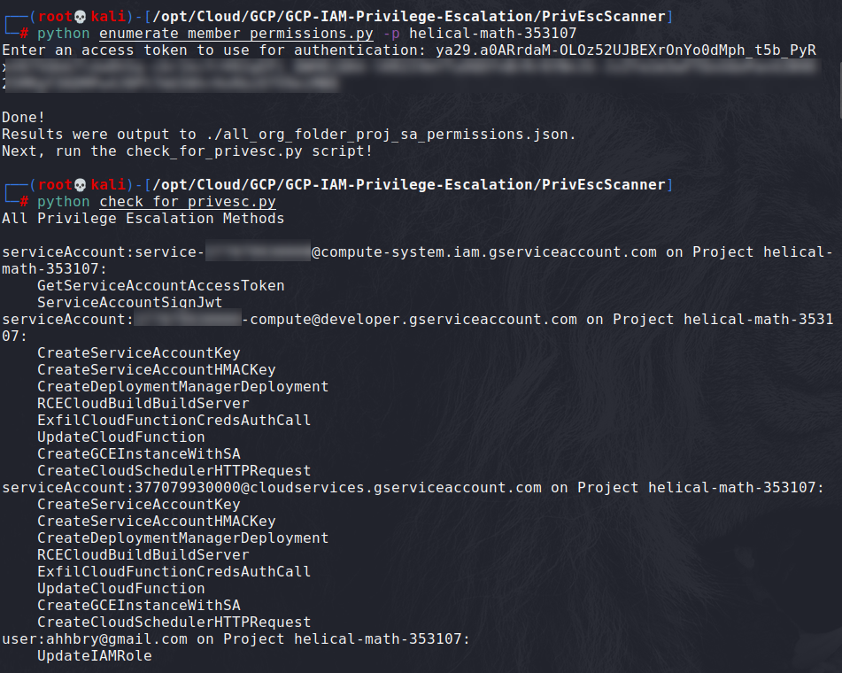

## Automated Privesc methods with Google Cloud permissions set.

GCP-IAM-Privesc - https://github.com/RhinoSecurityLabs/GCP-IAM-Privilege-Escalation

The PrivEscScanner Folder -
Contains a permissions enumerator for all members in a GCP account and an associated privilege escalation scanner that reviews the permissions in search of privilege escalation vulnerabilities.
First run enumerate_member_permissions.py to enumerate all members and permissions and then run check_for_privesc.py to check for privilege escalation in the environment.
The ExploitScripts Folder - 
Contains exploit scripts for each of the privilege escalation methods outlined in the blog post, as well as a Cloud Function and Docker image for some of the methods that require them.

**Prerequisites** 
* Install dependencies:
  * $ pip install -r requirements.txt
* gcloud auth access token

**Key features**
* The Privesc Scanner scripts, first scans the GCP environment and output IAM policies to a json format file. Second, based on the result of the enumerate_member_permissions.py run the check_for_privesc.py script that will recommend the paths to Privesc.
* The Exploit scripts offer different attack scenarios in order to escalate privileges in the GCP environment.

